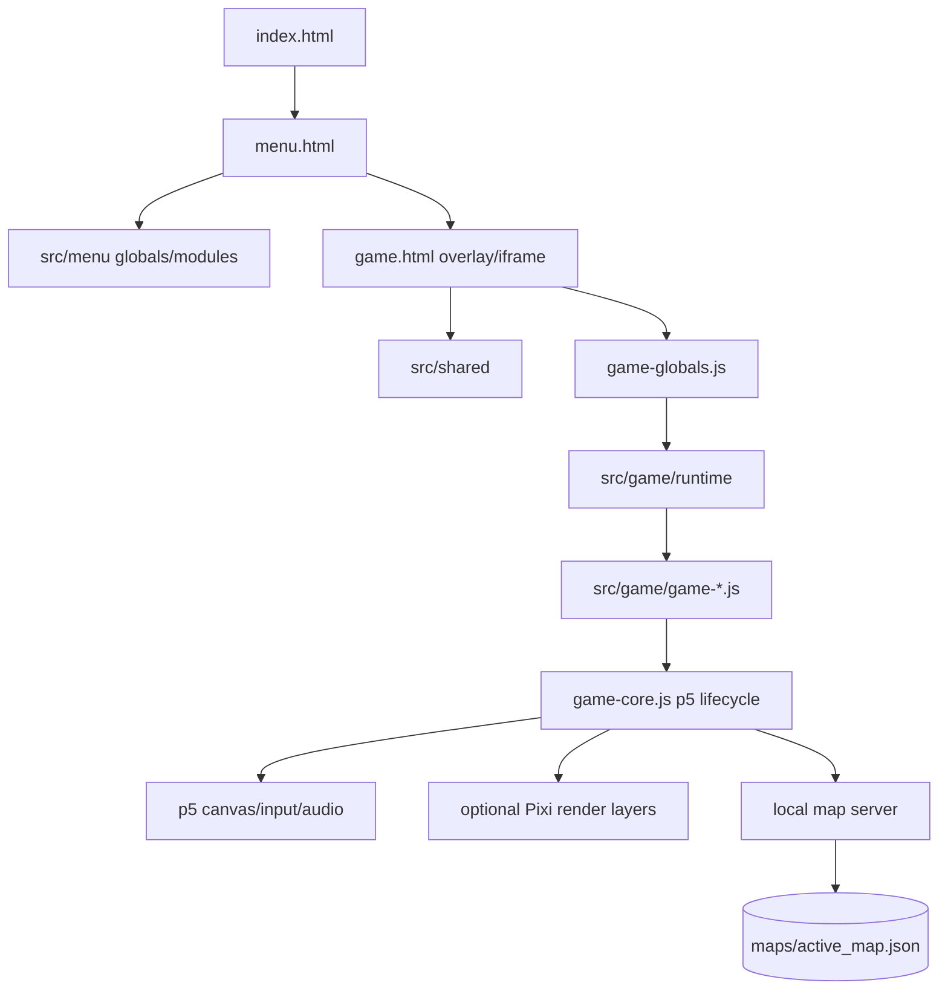

# Top-Down Procedural RPG Engine Technical Documentation

## System overview

This project is a browser-based procedural RPG implemented as ordered JavaScript globals over p5.js, p5.sound, and an optional PixiJS rendering backend. It has two browser applications: a menu/settings shell and the game runtime. A local Node HTTP server can persist the active generated map; Cloudflare deployment is intentionally static and therefore runs without map writes. The project uses no bundler, so HTML script order is the dependency graph.

## Browser runtime architecture

`index.html` redirects to `menu.html`, which loads shared constants/UI before menu globals and focused audio, I/O, video, zoom, UI, terminal, settings, and core modules. The menu launches the game as a full-screen overlay/iframe and exchanges lifecycle messages with `game.html`. Settings stored by the menu are read by the game runtime.

`game.html` loads pinned Pixi 7.4.3 and p5 1.6.0 CDN scripts first, then shared/global modules, runtime infrastructure, active Pixi adapters, domain modules, and finally `game-core.js`. `game-core.js` implements p5's preload/setup/draw lifecycle and orchestrates update/render stages. Because modules publish browser globals, moving a script before its dependencies causes runtime `ReferenceError`s even when each file passes syntax validation.

Domain files separate assets, terrain/map generation, enemies, movement, HUD, menus, settings, I/O, terminal commands, tutorials, world rules, utilities, and weather. Runtime files centralize input state, frame timing, scene selection, render delegation, caches, performance overlay, and Pixi renderers. Shared modules contain menu/game contracts.

## Simulation and rendering flow

The procedural world uses seeded/noise-driven terrain and object placement, river carving, hill smoothing, connectivity checks, enemies, pickups, weather, and day/night state. Input updates player intent; the frame loop clamps delta time and optionally consumes a bounded number of fixed simulation steps so tab suspension or slow frames do not teleport entities or create an unbounded catch-up spiral.

p5 owns gameplay simulation, input, audio, and the UI canvas. The selected render backend is persisted in localStorage. In p5 mode, the normal canvas renders the scene. In Pixi mode, Pixi owns the WebGL terrain/entity layers and p5 remains a transparent HUD, weather, and input overlay. Renderer modules and asset/HUD caches prevent domain code from duplicating backend-specific drawing and expensive per-frame lookups.

FPS mode is stored as `60`, `120`, or `unlimited`; 60 is the default. `CameraShake` applies one damped directional offset to both render layers, while `GameCombat.applyPlayerDamage()` centralizes armor, health feedback, invulnerability timing, knockback, and hit response.

Scene and loading overlays control the menu, gameplay, pause, settings, tutorial, failure, and transition states. Performance instrumentation records update/world/entity/weather/HUD/minimap and Pixi flush timing only when the diagnostics overlay is active.

## Persistence and local server

`scripts/map_server.js` serves an explicit public allowlist and three map operations. `GET /maps/active_map.json` returns the active map or creates a default. `POST /save-map` optionally requires `X-Map-Key`, checks the configured origin, bounds input to 5 MiB, parses JSON, and atomically replaces the active file. `GET /maps` lists JSON maps. Decoding, `path.relative` containment, and the allowlist prevent exposure of repository metadata, scripts, dependencies, or dot-directories.

Configuration is `PORT`, `MAP_SERVER_KEY`, and `ALLOWED_ORIGIN`. An empty key disables write authentication and wildcard origin allows any browser, so both must be set for a network-accessible server. The active-map write uses a temporary file plus rename. This remains a local single-writer service rather than a multi-user save API.

Cloudflare uses `scripts/build-static.mjs` to recreate `dist/` from an explicit allowlist of HTML, assets, source, and maps, rejecting individual assets above 25 MiB. `wrangler.jsonc` deploys that static directory. No Worker endpoint is shipped, so save/load writes are disabled in the hosted version by design.

## Security, reliability, and accessibility

Do not expose the local map server with wildcard CORS or an unset key. Saved maps remain untrusted input and must be validated by the client before use. Client errors never include host paths or exception stacks. CDN libraries are exact-version runtime dependencies; there are no duplicate vendored copies.

Audio must recover from browser autoplay suspension after user interaction. Loading overlays have failure escape paths. Delta clamping, asset fallbacks, scene ownership, and cache resets protect runtime recovery. Keyboard-only controls, focus restoration after overlays, text sizing, mute controls, reduced motion, contrast, and alternatives for canvas-only instructions are the primary accessibility concerns.

## Development, testing, and extension

Use `npm test` for map-server security coverage, `npm run build` to validate/create static output, and `npm run deploy` for Cloudflare. Use `node scripts/map_server.js` for full local map persistence. Also run `node --check` over JavaScript and smoke menu-to-game launch, both render backends, resize/zoom, pause/settings, save/load, regeneration, audio, terminal commands, and failure fallbacks.

Add simulation behavior to the owning domain file, backend drawing through renderer adapters, and shared menu/game constants in `src/shared`. Preserve HTML load order and global contracts. A future module/bundler migration must first define explicit imports and a compatibility layer rather than mechanically reordering files.
