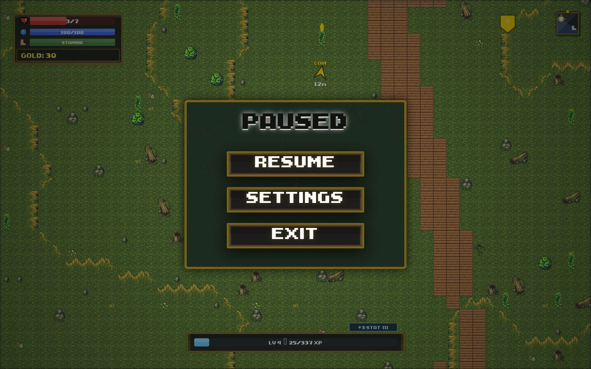
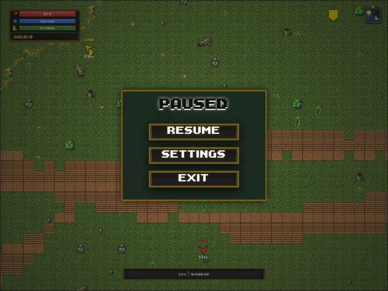

# Cloudflare runtime diagnosis and validation

Validated on 2026-10-05 against the deployed Workers site and the fixed local
Workers Static Assets build (`npm run dev -- --port 8787`, Wrangler 4.146.0).

## Findings and fixes

| Issue | Fix |
| --- | --- |
| Optional music held the preload gate; timers hid loading before readiness | Load music after setup, signal readiness only after the world is ready |
| Missing libraries, startup exceptions, or stalled generation left a blank/busy screen | Independent startup watchdog, Retry/Return to Menu, bounded generation retry |
| WebGL initialization failure or context loss stopped gameplay | Resume the Canvas renderer and its frame loop |
| Full-map terrain uploads exceeded smaller GPU texture limits | Crop terrain into bounded textures and release previous textures on regeneration |
| Terrain was baked repeatedly during generation | Bake once after terrain, objectives, and tree placement |
| Rivers/hills could cover spawn; props could block objectives | Protect spawn, check reachability after props, reserve reachable objective positions |
| Random coin/enemy attempts skipped or overlapped placements | Select unique reachable positions; guarantee 20 coins and one boss |
| Difficulty settings and generation used different values | Update both settings through the existing difficulty setter |
| Save loading duplicated logic and accepted malformed buffers/coordinates | Validate first and restore through one path; preserve player/prop layout and rebuild coins |
| Stale projectiles, input, and death overlays survived world changes | Reset transient state when replacing the world |
| Short movement taps disappeared between frames | Preserve input edges and buffer fresh turns |
| Default E attack was intercepted by a legacy spell | Prioritize configured melee binding |
| Tutorial dummy wandered during prompts and had mismatched health | Keep passive training dummy stationary with matching maximum health |
| Terminal typing left simulation active | Treat the terminal as an overlay |
| Old iframe callbacks could activate/close a replacement frame | Verify frame identity in deferred callbacks and readiness acknowledgments |
| Fullscreen denial produced an unhandled rejection | Handle denial and enable fullscreen on the game frame |
| Fast menu transitions emitted video playback cancellation errors | Handle native video playback promises |
| Development tooling pinned a vulnerable Undici patch | Update the existing override to 7.29.1 |

## Validation

- `npm ci`, `npm run build`, JavaScript syntax checks, and `git diff --check`.
- `npm test`: 38 passing tests, including 24 deterministic p5 noise seeds across
  Easy/Normal/Hard, reachable objectives, unique placement, malformed saves,
  GPU limits, renderer failure/context loss, startup timeout/retry, input, and tutorial behavior.
- `npm audit`: zero vulnerabilities after the patch update.
- Browser: deployed menu/tutorial inspected; fixed menu launched the game;
  pause/settings/close/resume/exit checked.
- Completed the fixed tutorial using WASD, E melee, coin pickups, and the portal
  without cheats; main forest generation completed.
- Pixi and Canvas worlds rendered and regenerated. Viewport checks included
  800×600 and 1440×900; Canvas backing dimensions matched the 800×600 viewport.
- Isolated local map server: restored a saved map, regenerated and saved a
  150×150 Hard world with 20 coins, 24 enemies, and persisted props/player position,
  then reloaded it. Existing workspace maps were not used or overwritten.
- Fullscreen was denied by the browser environment; the fixed game displayed
  its fallback notice without an unhandled rejection. Successful fullscreen
  entry remains dependent on browser permission.
- Forced missing-WebGL/context-loss and small-GPU behavior were checked with
  runtime tests; an actual GPU reset was not forced in the browser.

Production remains unchanged until this PR is merged and deployed. This report
covers reproduced issues and the specified smoke checks, not every possible
browser, device, or gameplay sequence.

## Screenshots

Pixi forest after completing training and opening pause:

Canvas renderer at 800×600:

