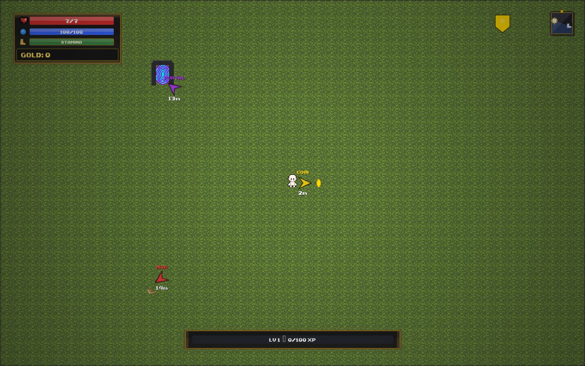

# Objective arrow direction

## Diagnosis

The original `drawCompass()` used a 12-tile target-lock distance to decide whether
an objective was visible. A visible portal roughly 13 tiles away was therefore
projected to the HUD boundary. The marker could land beyond the portal, while its
rotation remained the player-to-portal bearing.

A reproduction through the original drawing function used player screen position
(784, 432), target (464, 176), and HUD top limit 168. It placed the marker at
(454, 168), pointing at -141.34°. From that marker the target bearing is +38.66°:
the arrow faced exactly 180° away. Clamping and lane offsets could also invalidate
the original player-to-target bearing.

## Fix

- Use target screen position and HUD bounds for visibility; preserve the 12-tile
  threshold solely for existing target locking.
- Place visible markers beside targets and offscreen markers on the usable boundary.
- Calculate the final marker-to-target bearing after placement, offsets, and clamping.
- Keep ray origins inside HUD bounds; recover collapsed placements inward or hide
  an arrow when no meaningful direction exists.
- Use the same fractional camera coordinates as world rendering; update the HUD
  script cache version. Save formats and objective selection are unchanged.

## Validation

- `npm test`: 44 passing tests, including six new geometry/drawing regressions.
- Cases include the 13-tile reversal, 11.9/12/12.1/13-tile visible targets, eight
  bearings, lane offsets, boundary clamping, players outside HUD bounds,
  coincident/degenerate positions, and movement/fractional-camera integration.
- Syntax checks, `npm run build`, and `git diff --check` passed.
- Browser: Pixi and Canvas checked against an isolated saved-map fixture with
  a visible 13-tile portal; coin and mob markers checked together in Canvas.
  Resized between 1440×900 and 800×600; moved the player to check camera response.
  A portal outside the viewport was also checked. No console errors were observed.
- Fixtures were served from a temporary directory. Existing workspace map changes
  are excluded. Production changes require PR merge and deployment.

## Screenshots

Pixi, visible portal at 13 tiles:

Canvas, portal/coin/mob markers:

